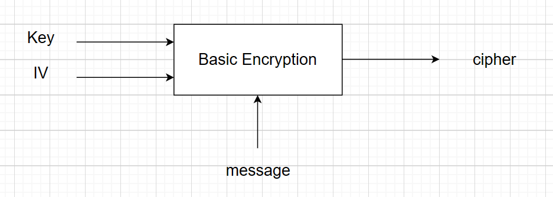
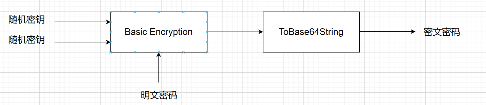
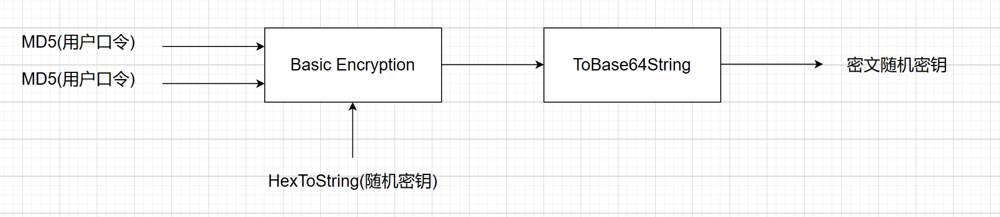

# Password Manager

A simple password manager built with WPF.


## Features

+ Single-user authentication.
+ Automatically generating random keys to encrypt your password.
+ Adding, modifying and deleting existing records.
+ Storing Data with Sqlite.

## Start using PasswordManager

### Getting the executable file

The executable file is available via Github Release. There's no need for installation.

### Build by yourself

1. Download the source code and install dependencies.

   ```
   git clone git@github.com:glimmeringlight/SimplePasswordManager.git
   dotnet restore
   ```

2. Build this project.

   ```
   cd SimplePasswordManager
   dotnet build ./PasswordManager/PasswordManager.csproj -c Release
   ```

The executable file is locate in `./PasswordManager/bin/Release/net8.0-windows`.

## Special notifications

### Encryption and Decryption Principle

Using `AES-128` as the symmetric encryption algorithm and `MD5` as the hash function.

#### Basic encryption



This algorithm is AES-128.

#### Principle of encrypting user's password



#### Principle of encryption random key



### Disclaimer

It is the user's responsibility to protect the database files. The author is NOT responsible for any password disclosure issues resulting from the use of this program.

